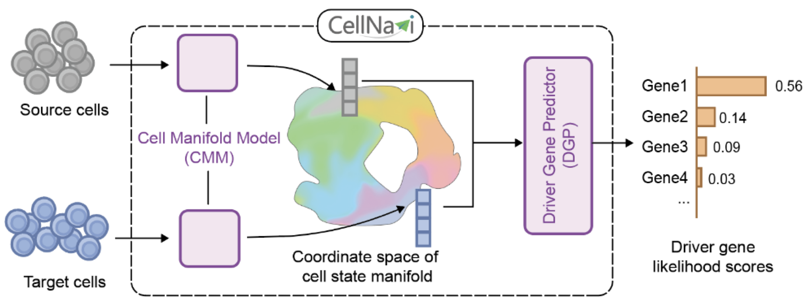

# CellNavi

CellNavi is a deep learning framework designed to predict genes driving cellular transitions. It is trained on large-scale, high-dimensional single-cell transcriptomic data, along with prior causal gene graphs that reveal the underlying structure of cell states. By projecting cellular data onto this biologically meaningful space with reduced dimensionality and enhanced biological relevance, CellNavi provides a universal framework that generalizes across diverse cellular contexts, with diverse applications including:

- identifying CRISPR target
- predicting mastergit regulator
- discovering disease driver
- elucidating drug MoA

<!--  -->
<p align="center">
  
</p>


## Installation

1. Create a new conda environment (Highly recommend!)

```sh
conda create -n cellnavi python=3.12
conda activate cellnavi
```

2. Clone the repo

```sh
git clone https://github.com/DLS5-Omics/CellNavi.git
```


3. Install the python package 'cellnavi'

```sh
cd ./CellNavi
pip install .
```

## Tutorials


Using subsets of the training and testing datasets in the T cell differentiation setting as a toy dataset example, we provide all the data needed to run the tutorials. The specific descriptions and download links are shown in the table below. Download all these datasets first before starting to run the tutorials.

| File name                            | Description                                                        | Download                                                                                                                              |
| :----------------------------------- | :----------------------------------------------------------------- | :------------------------------------------------------------------------------------------------------------------------------------ |
| pretrain_weights.pth                 | Model parameters pre-trained on 20 million single cells.           | 
[link](https://www.dropbox.com/scl/fo/khjdwuvc9gczr97dl3o2i/AGEb-jDCWPqOMTzxIfFNGU8?rlkey=n8c7w54fqyty9sgrv47sdaphl&st=qj1drwjw&dl=0) |
| Re-stimulated_t_example_train.h5ad   | Re-stimulated T cell example training dataset.                     | 
[link](https://www.dropbox.com/scl/fo/rq9klah7vqksn6e66dsae/AK3DJ2sxwL3MoWCOcQ9ZfFE?rlkey=1t4kz2vraif0ifu72c6gmo6xl&st=gpvwfw3j&dl=0) |
| Resting_t_example_test.h5ad          | Resting T cell example testing dataset.                            | 
[link](https://www.dropbox.com/scl/fo/rq9klah7vqksn6e66dsae/AK3DJ2sxwL3MoWCOcQ9ZfFE?rlkey=1t4kz2vraif0ifu72c6gmo6xl&st=gpvwfw3j&dl=0) |
| adj_t_matrix.csv                     | T cell gene regulatory adjacency matrix.                           | 
[link](https://www.dropbox.com/scl/fo/rq9klah7vqksn6e66dsae/AK3DJ2sxwL3MoWCOcQ9ZfFE?rlkey=1t4kz2vraif0ifu72c6gmo6xl&st=gpvwfw3j&dl=0) |
| dist_t_matrix.csv                    | T cell gene regulatory distance matrix.                            | 
[link](https://www.dropbox.com/scl/fo/rq9klah7vqksn6e66dsae/AK3DJ2sxwL3MoWCOcQ9ZfFE?rlkey=1t4kz2vraif0ifu72c6gmo6xl&st=gpvwfw3j&dl=0) |
| checkpoint-step-1000.pth             | Model parameters after training the example dataset for 1000 steps.| 
[link](https://www.dropbox.com/scl/fo/rq9klah7vqksn6e66dsae/AK3DJ2sxwL3MoWCOcQ9ZfFE?rlkey=1t4kz2vraif0ifu72c6gmo6xl&st=gpvwfw3j&dl=0) |

#### Fine-tuning

To facilitate the adjustment of model parameters and file paths, all configurable parameters are centralized in the `config.json` file. Before performing training or inference, you can directly modify the corresponding parameters in this file. In the `tutorials/.` folder, run 
```sh
bash launch_train.sh 
```
to start the training process.

The model will automatically continue fine-tuning from the file with the maximum training steps stored in `model_dir` in `config.json`. Otherwise, it will load the pre-trained file from `pretrain_model_dir` and start fine-tuning from pre-trained model weights.


#### Inference

After fine-tuning is completed, a python script is provided to obtain metrics such as accuracy and F1 score on the test dataset after fine-tuning. In the `tutorials/.` folder, run 

```sh
python start_validate.py -c <STEP TO EVALUATE>
```

Additionally, logits for each potential perturbed gene can be calculated in the test dataset. In the `tutorials/.` folder, run 


```sh
python load_results.py -c <STEP TO EVALUATE>
```

Please refer to `tutorials/inference.ipynb` for more detailed instructions.


## Citation   
```
@article{wang2024directing,
  title={Directing cellular transitions on gene graph-enhanced cell state manifold},
  author={Wang, Tianze and Pan, Yan and Ju, Fusong and Zheng, Shuxin and Liu, Chang and Min, Yaosen and Liu, Xinwei and Xia, Huanhuan and Liu, Guoqing and Liu, Haiguang and others},
  journal={bioRxiv},
  pages={2024--10},
  year={2024},
  publisher={Cold Spring Harbor Laboratory}
}
```